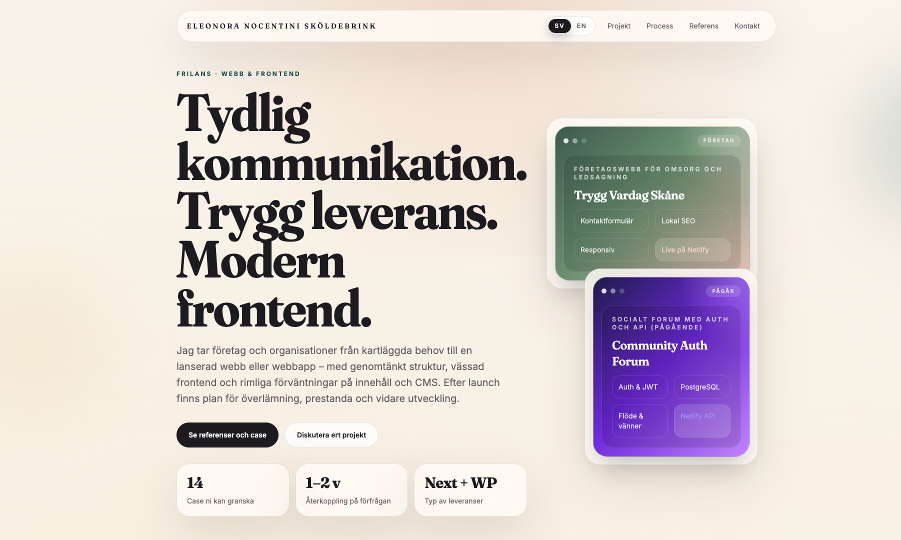
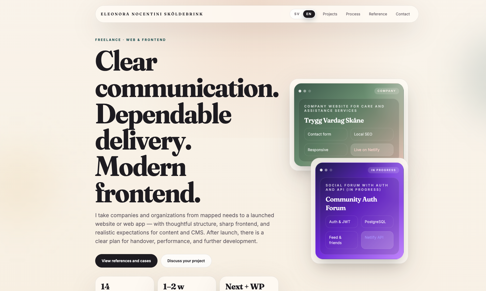
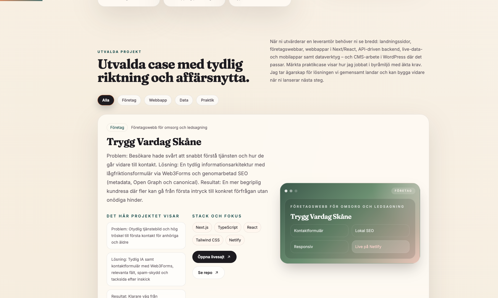

# Eleonora Portfolio

Personal developer portfolio for **Eleonora Nocentini Sköldebrink** — a freelance web and frontend developer. The site presents 14 client-style cases (company websites, web apps, API-heavy builds, and data projects), a verified internship reference, and a clear collaboration process.

**Live site:** [eleonora-portfolio.netlify.app](https://eleonora-portfolio.netlify.app/)

## Screenshots

### Home (Swedish)



### Home (English)



### Case studies with category filters



## Features

- **14 reviewable cases** — each with problem/solution/result framing, tech stack, live demo, and repository links
- **Category filtering** — company sites, web apps, data projects, and internship work
- **Bilingual (SV/EN)** — client-side language toggle with persistent preference via `localStorage`
- **Verified reference** — internship certificate from Capace Media Group with downloadable PDF
- **Modern interactions** — scroll-triggered reveal animations (IntersectionObserver), scroll progress indicator, and reduced-motion support
- **SEO-ready** — metadata, Open Graph image generation, canonical URLs, and semantic markup

## Tech Stack

| Layer | Technology |
| --- | --- |
| Framework | Next.js 16 (App Router, static export) |
| UI | React 19, TypeScript 5 |
| Styling | Tailwind CSS 4, custom design tokens |
| Typography | Fraunces (display) + Inter (body) via `next/font` |
| Hosting | Netlify (continuous deployment from `main`) |

## Getting Started

```bash
# Install dependencies
npm install

# Start the dev server
npm run dev

# Lint
npm run lint

# Production build (static export to ./out)
npm run build
```

The site is exported as fully static HTML (`output: "export"`), so the `out/` directory can be hosted on any static host.

## Deployment

Deployed on [Netlify](https://eleonora-portfolio.netlify.app/) with continuous deployment: every push to `main` triggers a build (`npm run build`) and publishes the `out/` directory.

## Project Structure

```
src/
  app/
    layout.tsx          # Root layout, fonts, and SEO metadata
    page.tsx            # Single-page portfolio (projects, process, reference, contact)
    globals.css         # Design tokens, animations, and global styles
    opengraph-image.tsx # Generated Open Graph image
docs/
  screenshots/          # README screenshots
public/
  references/           # Downloadable internship certificate (PDF)
```

## License

© Eleonora Nocentini Sköldebrink. All rights reserved.
